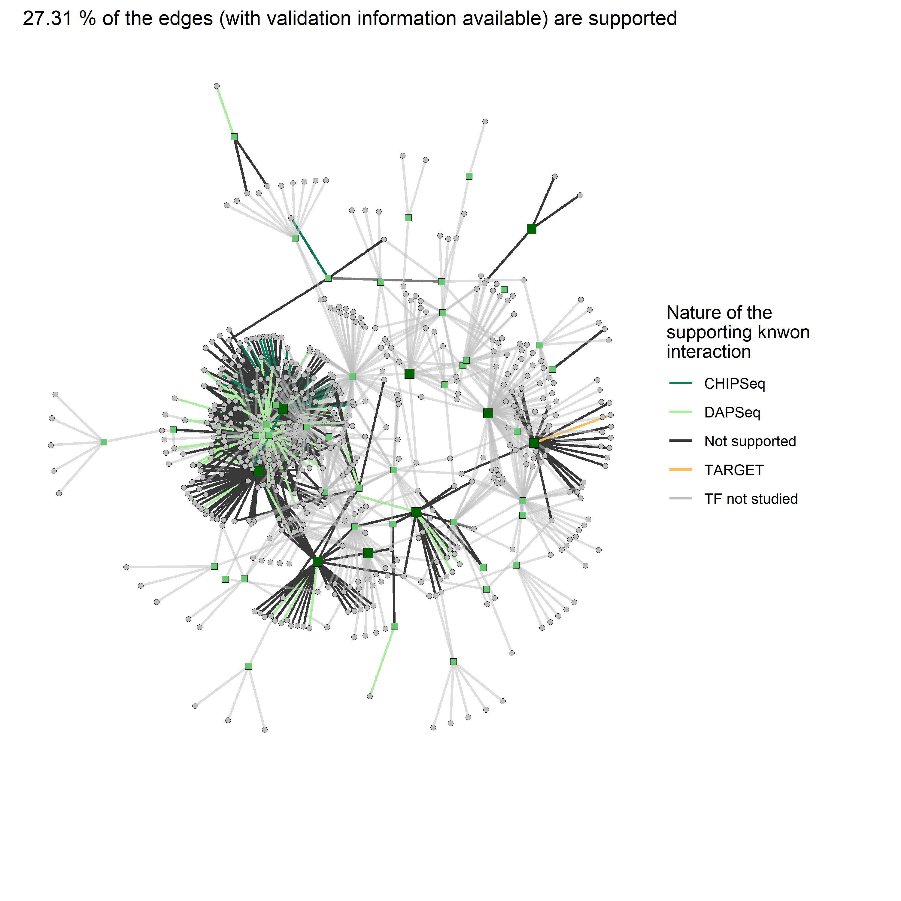

# AraNetBench

> AraNetBench is a package designed to evaluate the result of a network inference method against on known, experimentally determined, regulatory interactions in *Arabidopsis thaliana*.

## The task of validating network inference

In systems biology, reconstructing gene regulatory networks is at the same time an ultimate goal, as well as a real challenge. Usually, network inference methods predict connections between genes using expression values in a set of experimental conditions and genes of interest. Those predicted connections are supposed to carry information about the transcriptional dependencies at stake in the response to a developmental of adaptive mechanism. 

However, biological systems and the true regulatory networks orchestrating gene expression changes in cells are still far from being fully mapped. This makes it very difficult to asses weather network inference methods correctly predict those regulatory relationships between genes.

AraNetBench was made in an effort quantitatively validate inferred networks in *Arabidopsis thaliana* against the [connecTF database](https://connectf.org/). Although the connecTF plateform is a great online graphical tool, is does not allow to streamline and generalize the validation processes like scripts or automated pipelines would offer.

## Functionalities

This package thus contains several functions that can be called from R scripts given any inferred network in the form of an edges dataframe. Those functions :

+ Compute **evaluation metrics** on an inferred network such as true positives and true positive rate (interactions that are supported by experimental evidence), or false positives and false positive rate.

+ **Display a view of the network**, with its edges colored depending on their validation status, and the nature of the supporting information in connecTF.

+ Asses if the inference allowed a **significant improvement in biological meaning over randomness**.

---

Other functions to come soon, like drawing ROC curves on fully connected weighted inferred networks! 
